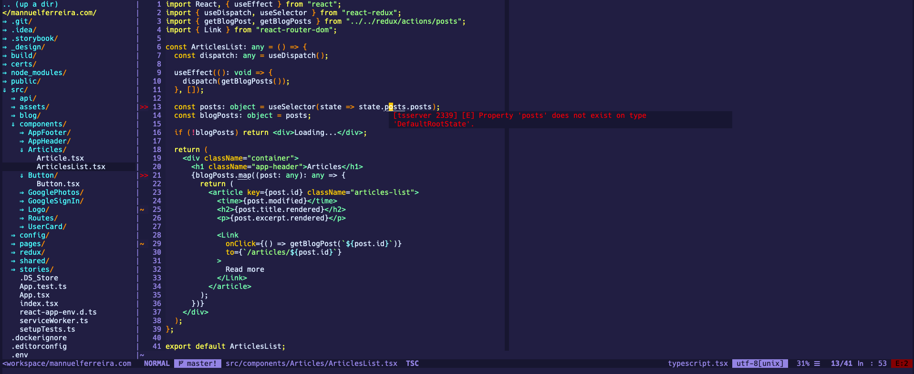

# .vimrc

My vimrc file, so we can take it anywhere

## How to use

1. fork repo
2. clone repo
3. delete your local .vimrc
4. symlink to this .vimrc and you should be good to go.
5. Install VIM-PLUG: [vim-plug](https://github.com/junegunn/vim-plug)
6. Open VIM ignore errors about cant find plugins, because on first launch you have no plugins installed and your vimrc is calling plugins, you have to get in and install plugins... so run the install command below.

### Install VIM-PLUG

```bash
curl -fLo ~/.vim/autoload/plug.vim --create-dirs \
    https://raw.githubusercontent.com/junegunn/vim-plug/master/plug.vim
```

```bash
:PluginInstall
```
If you get any errors in VIM do:

```bash
:PlugStatus
```
... and follow helpfull commands.

### Add symlink

```bash
ln -s $HOME/workspace/dotvimrc/.vimrc $HOME/.vimrc
```

## Screenshot

This is what you gonna get =>


